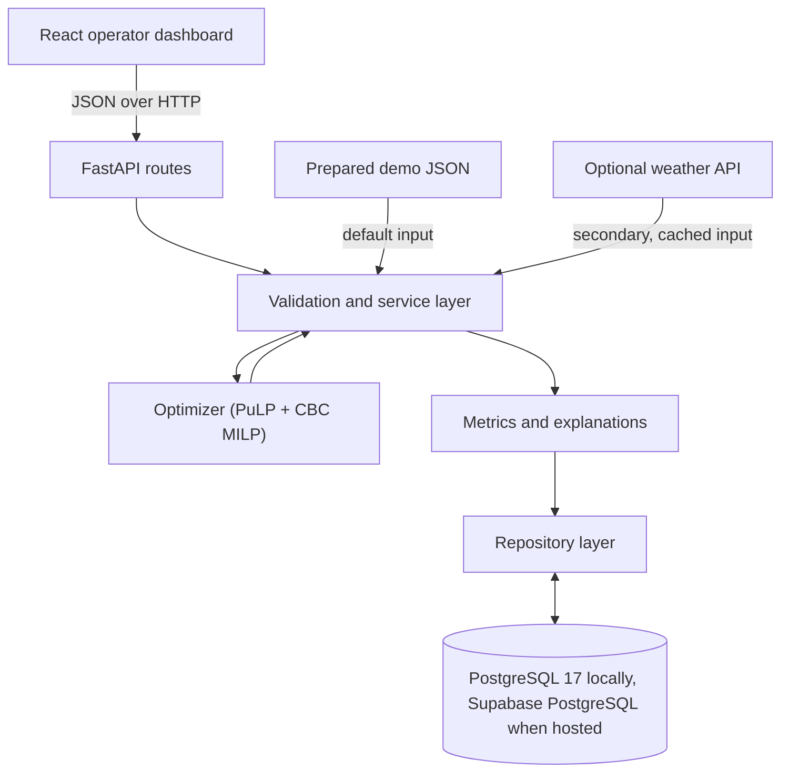
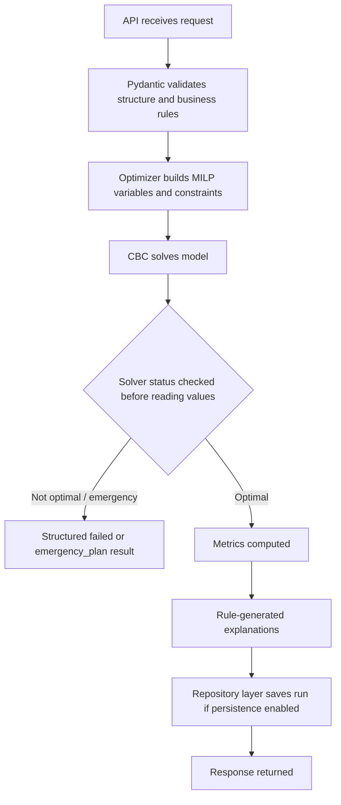

# Architecture

GridMitra is a modular monolith: one React frontend, one FastAPI backend, one optimization module inside the backend, one PostgreSQL database, and one prepared offline dataset. No microservices, no message queue, no mandatory external API.

## Correct architecture flow

```text
React
→ FastAPI routes
→ Validation and service layer
→ Optimizer
→ Metrics and explanations
→ Repository layer
→ PostgreSQL

Prepared JSON → Service layer
Optional weather API → Service layer
```



## Source-of-truth hierarchy

When documents disagree, follow this order:

1. `docs/PROJECT_SCOPE.md`
2. `docs/DECISIONS.md`
3. `docs/OPTIMIZATION_MODEL.md`
4. `docs/DATA_CONTRACT.md`
5. `docs/API_CONTRACT.md`
6. `docs/ARCHITECTURE.md` (this file)
7. Feature-specific documentation (`FRONTEND_FLOW.md`, `DATABASE.md`)
8. Implementation code
9. `README.md`

Update the relevant document whenever a contract changes; implementation must eventually match the documentation.

## Repository layout

```text
gridmitra/
├── frontend/                 React + TypeScript + Tailwind + ECharts
│   ├── src/
│   │   ├── App.tsx           App shell and routing
│   │   ├── types.ts          Shared API types (mirror of DATA_CONTRACT.md)
│   │   ├── lib/api.ts        Typed HTTP client
│   │   ├── components/       Charts and UI cards
│   │   └── styles.css
│   ├── Dockerfile            Node 20 dev server
│   └── package.json
├── backend/                  FastAPI + PuLP
│   ├── app/
│   │   ├── main.py           FastAPI app, CORS, router registration
│   │   ├── api/routes.py     HTTP endpoints only
│   │   ├── models.py         Pydantic request/response schemas + validation
│   │   ├── core/             Config and database readiness check
│   │   └── services/
│   │       └── optimizer.py  MILP model, solver, metrics, explanations
│   ├── tests/                Backend and optimizer tests
│   ├── Dockerfile            Python 3.12 API
│   └── requirements*.txt
├── db/init/001_schema.sql    PostgreSQL schema (private gridmitra schema)
├── data/demo_scenario.json   Prepared 24-hour demo inputs
├── scripts/                  Cross-platform setup helpers
├── docs/                     Scope, architecture, API, and workflow
├── .github/                  CI and collaboration templates
├── AGENTS.md                 Shared context for AI coding tools
└── compose.yaml              Local development stack
```

## Layer responsibilities

| Layer | Responsibility |
| --- | --- |
| React frontend | Forms, scenario state, results, charts, and explanations. Contains **no** optimization math and no hard-coded KPI values. |
| FastAPI routes (`api/routes.py`) | HTTP transport, request/response mapping, error translation. No PuLP code here. |
| Service layer (`services/`) | Orchestrates validation → model build → solve → metrics → explanations. |
| Optimizer (`services/optimizer.py`) | Pure MILP dispatch model; owns the mathematical decisions and derived KPIs. |
| Metrics and explanations | Derived KPIs and rule-generated operator sentences. |
| Repository layer | All Supabase/PostgreSQL read and write operations, isolated in repository modules. |
| PostgreSQL/Supabase | Stores scenarios and optimization runs. |
| Prepared demo JSON | Default input source; never requires a live API. |
| Optional weather API | Secondary input source; must be cached and optional. |

### Boundary rules

- The optimizer is a pure Python module and must not access FastAPI, React, or the database directly.
- All Supabase/PostgreSQL operations are isolated inside repository modules; the service layer calls them only through those modules.
- The frontend displays calculated backend results only; it never computes dispatch math.

## Local services

| Service | Container | Port | Purpose |
| --- | --- | ---: | --- |
| Frontend | Node 20 | 5173 | Vite development server |
| Backend | Python 3.12 | 8000 | API, optimization, calculations |
| Database | PostgreSQL 17 container | 5432 | Scenarios and optimization runs |

`compose.yaml` wires the three services with health checks and ordered startup: `db` healthy → `backend` healthy → `frontend`. The local database is a PostgreSQL 17 container, not Supabase; Supabase is used only for hosted deployment.

## Backend request flow

For `POST /api/v1/optimize`:



### Current endpoints

| Method | Endpoint | Purpose |
| --- | --- | --- |
| GET | `/api/v1/health` | API, solver, and database readiness |
| GET | `/api/v1/scenarios/demo` | Prepared demo scenario (reads `data/demo_scenario.json`) |
| POST | `/api/v1/optimize` | Validate and solve one 24-hour dispatch |

Planned: run persistence/list/export endpoints, and a scenario endpoint set for the Scenario Lab.

## Data boundary

The frontend sends only typed scenario JSON. FastAPI owns validation and the backend owns all optimization logic. This prevents two different calculation engines from appearing in the project.

The local database uses a private `gridmitra` schema with tables `scenarios` and `optimization_runs`. If hosted on Supabase, keep this schema outside the Data API unless direct browser access is intentionally introduced; if any table is exposed later, add minimum grants and tested row-level security policies in the same migration.

Persistence is **not yet wired into the API flow**; the schema is ready (`db/init/001_schema.sql`), and the demo path runs purely from prepared JSON so it works without a database if needed.

## Validation

Pydantic enforces: exactly 24 hourly records covering hours 0–23; non-negative loads and availability; SOC bounds consistent (initial inside hard bounds, min ≤ max, max ≤ capacity, reserve ≤ max); positive battery/diesel limits; positive penalties with correct priority ordering (critical > flexible, reserve-shortfall > critical). Invalid input returns a clear error before any solver runs.

## Optimization model (summary)

Full detail belongs in `docs/OPTIMIZATION_MODEL.md`. Current implementation in `services/optimizer.py`:

- MILP with binary `charge_mode` per hour; `charge ≤ max_charge × charge_mode` and `discharge ≤ max_discharge × (1 − charge_mode)` prevent simultaneous charging and discharging.
- Hourly energy balance: solar + wind + diesel + discharge + unserved = served load + charge.
- SOC update with charge/discharge efficiency; SOC bounded by hard min/max.
- Soft terminal reserve: `soc[23] + reserve_shortfall ≥ reserve_target`, `reserve_shortfall ≥ 0`, penalized above the critical-load penalty.
- Objective: diesel cost + carbon cost (`carbon_price × emission_factor` on diesel energy) + battery throughput wear + unserved-critical penalty + unserved-flexible penalty + reserve-shortfall penalty.
- The solver status is checked before any decision-variable value is read; a non-optimal status never yields a dispatch as if it were valid.

### Known limitations vs. target scope

- Load tiers are currently **critical** (P1) and **flexible** (aggregated P2/P3/P4). Splitting into P1–P4 is a planned enhancement.
- No reactive no-lookahead baseline yet (renewables first, battery without future planning, diesel for the deficit, then P4-to-P1 reduction). Planned: run baseline and optimized plans on identical inputs to demonstrate improvement without hard-coded percentages.
- No curtailment penalty; unutilized renewable availability is implicit rather than reported. Planned: explicit curtailment reporting.

## Resilience and error handling

- Prepared data is the primary judge-demo path; live weather is optional and cached.
- Unserved-energy variables make supply shortages solvable; the soft reserve makes reserve misses solvable and visible.
- Extreme scenarios return plans with unmet load and warnings instead of an infeasible blank screen.
- A database failure must not invalidate an optimization result that has already been calculated; the response is returned even if saving the run fails.
- The backend must check the solver status before reading decision-variable values; solver failures translate to a structured failed result, never a dispatch made from invalid values.
- Backend health endpoint reports API, solver, and database availability separately; a database failure must not make API health appear completely unavailable.

## Security

- Browser-safe variables use the `VITE_` prefix; never put service-role or database credentials there.
- The browser calls FastAPI; only the server connects to PostgreSQL/Supabase.
- Private operational tables stay outside the exposed API schema, or get explicit grants and RLS before exposure.
- Never commit `.env`.

## Deployment (target)

- Frontend: Vercel.
- Backend: Render or Railway.
- Database: Supabase PostgreSQL; `db/init/001_schema.sql` applies as the baseline migration.
- Demo must remain fully functional offline (prepared data path) regardless of deployment choices.